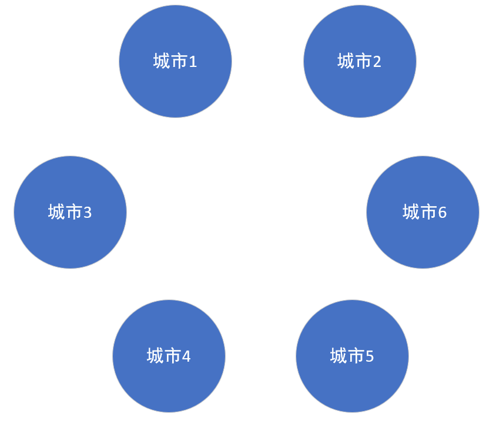
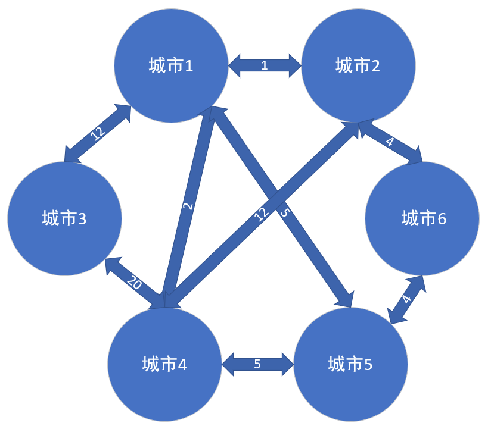
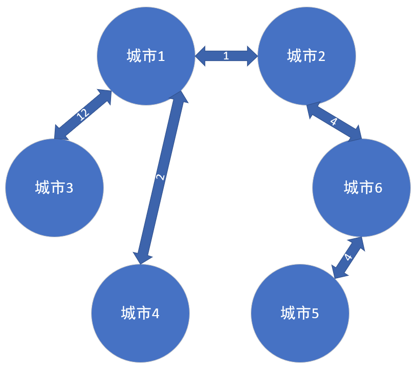
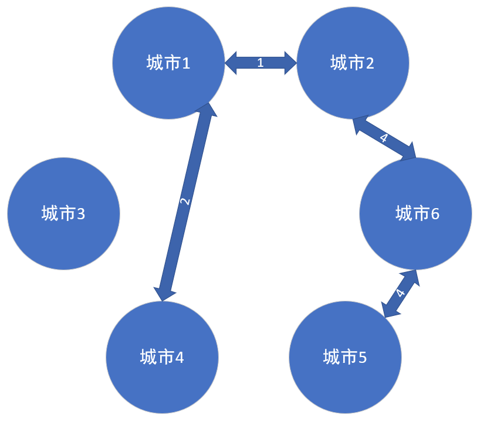
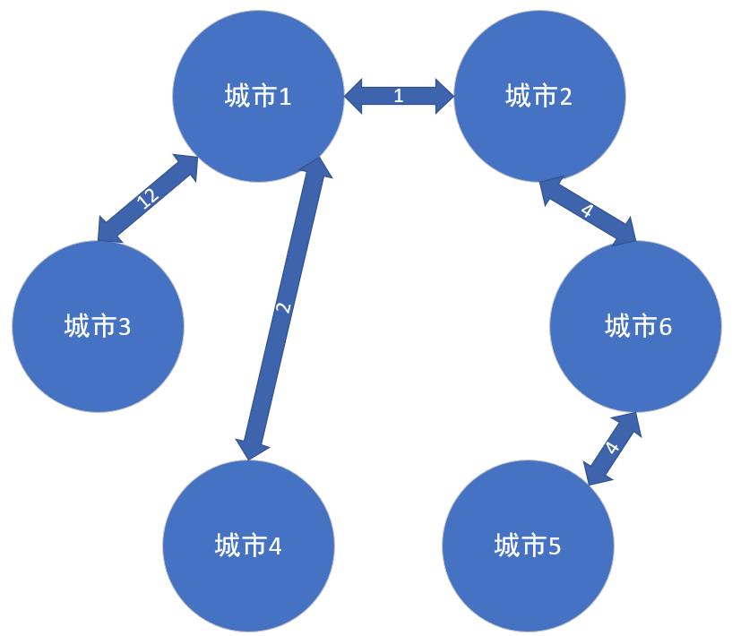

# 最小生成树之普利姆（ Prim ）算法

---

我们来讲述普利姆（ Prim ）算法。

和克鲁斯卡尔算法一样，普利姆算法也是一种构造最小生成树的算法。

- 主要思想是：
- > 首先随意从一个点出发，然后每次找他们的最小相邻边，每经过一个顶点，那边找其顶点的最小权值的边。一直到找到了 n 条边，( n=定点数-1 ) 然后我们的算法结束

普利姆算法是利用了贪心思想的特性，但是对于有负权值的边，普利姆算法并不适用，此时应该用克鲁斯卡尔算法 **（ [------>这是我的另一篇文章，讲述克鲁斯卡尔算法,有兴趣看看啊♪(´▽｀)<------]() ）** 

---

### 举个栗子 **(╹ڡ╹ )** ：比如有六个城市，分别是城市1，城市2，城市3，城市4，城市5，城市6，我们的目标是：**选择几条线路，把这几个城市连起来，让城市间能够相互到达，但是不能有回路**。如图.....


### 在这几个城市中，我们测量了每个城市之间的路线，他们的权值分别如下:

|开始城市|到达城市|路线长度(权值)|
|:-:|:-:|:-:|
|城市1|城市2|1|
|城市1|城市3|12|
|城市1|城市4|2|
|城市1|城市5|5|
|城市2|城市6|4|
|城市2|城市4|12|
|城市6|城市5|4|
|城市5|城市4|5|
|城市4|城市3|20|

### 也就是如图所示：


### 然后，我们的目标是，从这几条边中找到能够连通所有点的边并且这些边是最小权值的。也就是像下面的图一样


### 然后我们，从城市1开始吧 o( * ￣ ▽ ￣ * )o。

### 从城市1开始的话，我们会把城市1所相邻的边放进一个集合里面，然后找城市1相邻的边的最小值。我们很容易可以找到，它是1，那么我们把1选上，然后1所相连的是城市2，这样，我们找到了第一条路径，并且这条路径是能够从城市1到达城市2的 (o゜▽゜)o☆


### 从城市1开始，我们把边1，2，5，12放进集合了，然后我们选了1，现在把1从集合里面移除。由于加入了城市2，那么我们把城市2相关邻的边放进集合里面，此时集合里面就有了2，5，12，4，12，然后我们再在这里面找权值最小的边，然后再相连，然后重复这个操作。

### 当你找到一条边，这条边刚刚好两边都经历过了，那我们就舍弃这条边，然后继续向下找，直到所有的点都遍历过了之后，就结束操作，我们就构成了一棵最小生成树。



 

---

然后让我们来看看代码的实现。代码实现，我采用了邻接矩阵的存储结构

### main.cpp

```c++

#include"GraphPrim.h"

int main()
{
	GraphPrim g1;
	g1.Init();
	g1.Display();
	return 0;
}

```

### GraphPrim.h

```c++

#pragma once
#ifndef _GRAPHPRIM_H_
#define _GRAPHPRIM_H_
#include<iostream>
#include<cstdlib>
#include<vector>
using namespace std;

const int MAX = INT_MAX;

class GraphPrim
{
private:
	vector<vector<int>>graph;//邻接矩阵存储点与边的关系
	vector<bool>visited;//判断是否经历过
	vector<int>side;

	vector<int>node;//取点的路径，用来存放输出点的顺序
	vector<int>useSide;//使用的边，用来存放边的权值

	int nodeNumber;//点的个数
	int startPoint;//开始点
	int sum;

	int findMin(vector<int>& ans);//返回下标

public:
	void Init();//初始化
	void Prim(int start);//普利姆算法，以及开始点
	void Display();//显示参数
};


#endif // !_GRAPHPRIM_H_


```

### Graphprim.cpp

```c++

#include "GraphPrim.h"

int GraphPrim::findMin(vector<int>& ans)
{
	int index = 0;
	int min = ans[0];
	for (int i = 0; i < ans.size(); i++)
	{
		if (min > ans[i])
		{
			min = ans[i];
			index = i;
		}
	}
	return index;
}

void GraphPrim::Init()
{
	cout << "请输入点的个数" << endl;
	cin >> nodeNumber;

	visited.resize(nodeNumber + 1);//初始化

	graph.resize(nodeNumber + 1);//初始化
	for (int i = 0; i <nodeNumber + 1; i++)
		graph[i].resize(nodeNumber + 1, MAX);

	cout << "请输入开始点" << endl;
	cin >> startPoint;
	int a, b;
	cout << "请输入出发点、到达点和路径长度,以‘#’为全部结束" << endl;
	while ((cin >> a && a != '#') && (cin >> b && b != '#'))
	{
		cin >> graph[a][b];//输入权值
		graph[b][a] = graph[a][b];
	}
}

void GraphPrim::Prim(int start)
{
	int temp;
	sum = 0;		
	side.resize(nodeNumber + 1);
	node.push_back(start);
	visited[start] = true;
	for(int i = 1; i <= nodeNumber; i++)
		side[i] = graph[start][i];	
	for(int i = 1; i <= nodeNumber; i++)//找生成树集合点集相连最小权值的边	
	{
		temp = MAX;
		for(int j = 1; j <= nodeNumber; j++)
			if (!visited[j] && temp > side[j])
			{
				temp = side[start = j];
			}
		if(temp == MAX)//如果是无穷了
			break;	
		visited[start] = true; //加入最小生成树集合
		node.push_back(start);
		useSide.push_back(temp);
		sum += temp;//记录权值之和		
		for(int j = 1; j <= nodeNumber; ++j) //更新边数组	
			if (!visited[j] && side[j] > graph[start][j])
			{
				side[j] = graph[start][j];
			}
	}
}

void GraphPrim::Display()
{
	Prim(startPoint);
	cout << "显示最大权值" << sum << endl;
	cout << "路径显示: ";
	for (int i = 0; i < node.size(); i++)
		cout << node[i] << " ";
	cout << endl;
}


```
