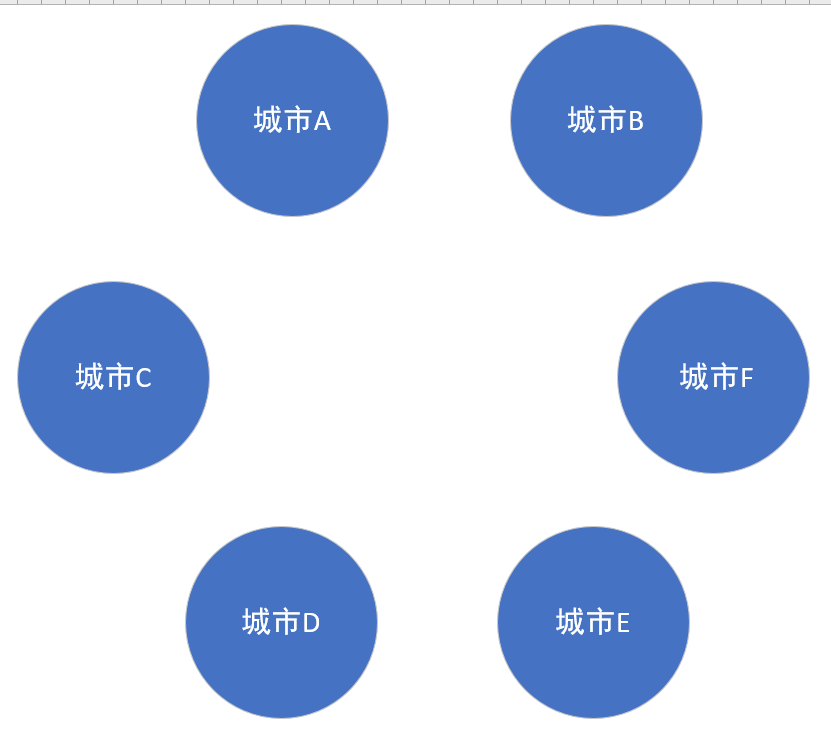

# Minimal-spanning-tree
最小生成树
# 最小生成树

---

接下来是介绍最小生成树的内容。

什么是最小生成树？

> 定义： 各边的代价之和最小的那棵生成树称为该连通网的最小代价生成树（ Minimum Cost Spanning Tree ），简称最小生成树。

构成最小生成树的算法有很多，其中多数的算法都是利用了最下生成树的一种性质：

>性质： 假设N=(V,E)是一个连通网，U是顶点集V的一个非空子集。若(u,v)是一条具有最小权值(或者说代价)的边，其中u∈U，v∈V-U，那么必定存在一颗包含边(u,v)的最小生成树

总结起来，得具备这些条件：

- 是一个连通网（连通图）
- 各边有权值

如果还不了解，那么我们来举一个例子：

比方说我们需要在n个城市中建立一个联系网，因为城市众多，我们当然不可能一一给他们都连通，考虑到价格问题，我们必须得用最小的代价从而连通所有的城市。

该怎么做呢?好难(っ °Д °;)っ

---

#### 我们用圆圈来表示每个城市


#### 然后用箭头中包含的值来表示权值


#### 我们的问题来了，我们该怎样去选择，从而达到我们的目的呢？ （  我们的目的是：德玛西亚d=====(￣▽￣*)b.......当然....目的是选择几条路线，组成的权值最小，并且能够把这几个点连接上...... ） 

#### 首先我们用眼睛观察.....然后我们很容易选出这几条路线：


#### 然后我们来算算，总权值是：1+2+4+5+12=24。没错，这就是最小生成树的构成，我们所选的路线并没有错。那么问题来了。我们是 **怎么选** 的呢？

#### 还记得我们刚刚选的方式么？我的思路是，先把他们的各个边按照权值从小到大排序，排完序之后，再从中选出我所需要的边，直到所有的点覆盖完成，当然，如果有一条边是存在于已经连过的两个顶点之间，我就不要了，因为这两个城市已经走过了(●ˇ∀ˇ●)。 
#### 当所有的顶点都连接完成之后，我们的最小生成树也就构成了。如果排完序那么我们是这样的一个序列：

|城市|可通城市|权值|
|:-:|:-:|:-:|
|A|B|1|
|A|D|2|
|B|F|4|
|A|E|5|
|E|F|9|
|A|C|12|
|B|C|13|
|C|D|18|
|D|E|32|

然后对应 A B C D E F 转换为数字便是: 1 2 3 4 5 6

然后，我们从小到大，选择便是以下的情况：


由于我们有六个点，那么我们选择五条边，就完成了我们所需要的最小生成树。没错，这便是我要说的最小生成树的一种算法：（Kruskal 克鲁斯卡尔算法）

比较官方的构造过程便是：
>- 假设连通网N=(V,E),将N中的边按权值从小到大的顺序排列
>- 初始状态为只有n个顶点而无边的非连通图T=(V,{}),图中每个顶点自成一个连通分量。
>- 在E中选择权值最小的边，若该边依附的顶点落在T中不同的连通分量上（即不形成回路），则将此边加入到T中，否则舍去此边而选择下一条权值最小的边
>- 重复操作，直到T中所有顶点都在同一连通分量上为止

一波官方的解释，看着我有点懵 (＠_＠) ，但是没事，我有自己的理解。接下来便是代码实现了......

---

### main.cpp

```c++
#include"GraphKruskal.h"

int main()
{
	GraphKurskal g1;
	g1.Init();
	g1.Kruskal();
	g1.Display();
	return 0;
}

/*
输入样例：
1 1 1
1 4 2
2 6 4
1 5 5
5 6 9
1 3 12
2 3 13
3 4 18
4 5 32

*/

```

### GraphKruskal.h	
```c++
#pragma once
#ifndef _GRAPHKRUSKAL_H_
#define _GRAPHKRUSKAL_H_
#include<iostream>
#include<algorithm>
#include<cstdlib>
#include<vector>
using namespace std;
//	这是利用邻接矩阵来实现的克鲁斯卡尔搜索最小生成树的算法
struct node
{
	int from, to;
	int sideID;//记录边号，已选定可以输出的边
	int distance;
};

class GraphKurskal
{
private:
	vector<node>graph;//记录边
	vector<bool>visited;//是否经历过
	vector<int>IDofSide;//每条边的ID
	int minDistacne;//最小权值
	int nodeNumber;//几个点

	//void Sort();//这个程序是调用库函数的sort函数进行排序，因此没有写自定义sort函数
public:
	void Init();//初始化
	void Kruskal();//进行克鲁斯卡尔算法，找到最小生成树
	void Display();//显示

};
bool cmp(node a1,node a2);//从小到大排序的函数

#endif // !_GRAPHKRUSKAL_H_

```

### GraphKruskal.cpp

```c++
#include "GraphKruskal.h"


void GraphKurskal::Init()
{
	node n1;
	int i = 0;
	cout << "请输入有几个点" << endl;
	cin >> nodeNumber;
	visited.resize(nodeNumber + 1, false);
	cout << "请输入各边的关系，'#'结束" << endl;
	cout << "请按照格式：开始点---终止点---距离" << endl;
	while ((cin >> n1.from&& n1.from != '#') && (cin >> n1.to&& n1.to != '#'))
	{
		cin >> n1.distance;
		n1.sideID = ++i;
		graph.push_back(n1);
	}
}

void GraphKurskal::Kruskal()
{

	sort(graph.begin(), graph.end(),cmp);//进行函数比较
		//当选择的边数不为节点数减一的情况，我们继续循环
	minDistacne = 0;
	for (int i = 0; i < graph.size(); i++)
	{
		//判断图中的点是否遍历过，如果遍历过，那么跳过，否则继续遍历
		if (!visited[graph[i].from] || !visited[graph[i].to])
		{
			visited[graph[i].from] = true;
			visited[graph[i].to] = true;
			IDofSide.push_back(graph[i].sideID);
			minDistacne += graph[i].distance;
			if (IDofSide.size() == nodeNumber - 1)
				break;
		}
	}
}

void GraphKurskal::Display()
{
	cout << "总距离是：" << minDistacne << endl<<"权边是：";
	for (int i = 0; i < IDofSide.size(); i++)
		cout << graph[IDofSide[i]-1].distance << " ";
	cout << endl;
}

bool cmp(node a1, node a2)
{
	return a1.distance > a2.distance ? false : true;
}

```

代码实现结果:


---

借鉴《数据结构C语言版|第2版》

---

[photo1]:https://img2018.cnblogs.com/blog/1723659/201911/1723659-20191118184029330-1092051152.png

[photo2]:https://img2018.cnblogs.com/blog/1723659/201911/1723659-20191118184048645-675559091.png

[photo3]:https://img2018.cnblogs.com/blog/1723659/201911/1723659-20191118184122291-1789315556.png

[choose1]:https://img2018.cnblogs.com/blog/1723659/201911/1723659-20191118184145276-750536562.png

[choose2]:https://img2018.cnblogs.com/blog/1723659/201911/1723659-20191118184205325-1420359833.png

[choose3]:https://img2018.cnblogs.com/blog/1723659/201911/1723659-20191118184250870-391053065.png

[choose4]:https://img2018.cnblogs.com/blog/1723659/201911/1723659-20191118184330977-463721853.png

[choose5]:https://img2018.cnblogs.com/blog/1723659/201911/1723659-20191118184350080-1670680927.png

[show1]:https://img2018.cnblogs.com/blog/1723659/201911/1723659-20191118184404873-1565278231.png


